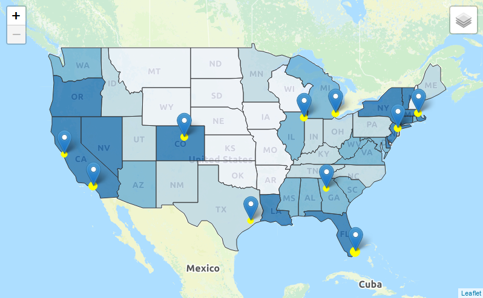

```{r setup, include=FALSE}
knitr::opts_chunk$set(echo = TRUE)
```

This is the Process Book for Group C: Rent Burden by Doruk Kilitcioglu, Gaurav Bhardwaj, and Hoyoung Jun. Here we have included our process of making the R Shiny app, including graphs and work that did not make it to the final output. We decided to not include any code to keep the Markdown file simple and less complicated, but we have attached screenshots of visualizations we considered using. All of the code can be found in our Github repository for the project. We will mention the specific location of the code on each section.

## Time Series Graphs for Median Rent In Metro Areas

Using time series graph was an obvious choice for our project. There is not much of an alternative to time series when it comes to visualizing rent burden over time.
We thought that showing information about median rent price across the biggest metro areas was crucial. It allows users to quickly look at different rent prices across cities and maybe even compare it to their own rent price. It provides an objective number that is important when considering rent burden.
The code and data for this part of the process book is available inside the ??time_series?? folder in our Github repository (https://github.com/DS-GA3001-015/Group_C_RentBurden/tree/master/time_series)
We got our median rent data from Zillow. Data was available from 2010 to 2018. The data contained a great amount of cities, so we handpicked the cities we wanted to look at. The dataframe and its content had to be edited in order to be displayed as different types of graphs (ggplot, dygrpah, etc.). 

We first plotted the graph for New York City, shown below. We added them_minimal() afterwards to reinforce simplicity and straightforward conveyance of information. 


After testing out the graph for NYC, we decided to plot the rest of the cities. We used to melt() function to be able to plot all the median rent burden time series together. We then added plotly to add interactivity. Adding plotly was essential since it would allow users to select the cities they wanted to see or not see.


We wanted to see how would it look if we could show the graphs separately within one sight, so we tried the following method.


We liked this method as well. However, we were already going to allow the users see the plots individually on the R Shiny map, so we thought it would be better to include the previous one since it directly shows the comparison between countries on the same graph.

We tried to see other ways of showing median rent price comparisons, so we used dygraph and plotted the results below.


It looked fine and the slider below looked useful. Yet, users were not able to select and unselect cities they wanted to see, and the popups looked crowded. As a result, we decided to go with the previous option.


The data provided by Zillow was not adjusted to inflation, and in order to see the real effect of rising rent prices on rent burden, we decided that it would be better to give the users to see inflation adjusted median rent prices. In order to do so, we retrieved the CPI index for each year and calculated inflation adjusted rent prices setting 2010 as the base year. We then plotted the data and received the following.


The trends look similar overall, but compared to the original graph the slope is slightly less steep.

Instead of just plotting past data, we thought that perhaps forecasting future rent prices could be a good idea. Therefore, we used arima to try to forecast the median rent prices for NYC. The result was the following.


The forecast showed a slight upward slope, yet overall it seemed unamusing. The line seemed too plain and straight. 

We wanted to further explore different styles of graphs we could use for either individual or group plots. The below two are from the quantmod package which is usually used for financial modelling. Unfortunately, they do not seem to work well with non financial data.


We then tried a lollipop graph offered in dygraphs. Although it seemed like an interesting approach, it was not the best way to convey clear information in our case.


Inspired by financial graphs used for stock and foreign exchange markets, we tried to use a candlestick plot to represent the rising and falling rent prices. We used dygraphs to implement this as well.


Although the candlestick method looked fine, we had to create fake default high and low prices to visualize this model as these were not provided in the dataset. Moreover, it did not seem completely necessary to use candlestick models to plot median rent prices.

We also experimented with the overall comparison plot by using filled layers instead of lines.


It was clear that the visualization was confusing, and moreover it was not able to show individual selected plots accurately.

Instead of only visualizing the median rent price for every year, we thought that plotting the growth rate of each city would be a good way to see whether rent prices and burden are constantly increasing or not. We calculated the growth in percentage for every two points in time and labeled whether a growth rate was positive or negative. We used ggplot2 to display the following.


We tried the same using a line graph, but decided that the previous more effectively showed the discrepancies between growth rates each year.


## Time Series Graphs for Rent Burden in Metro Areas

The code and data for this section is available inside the ??cities_rent_burden?? folder (https://github.com/DS-GA3001-015/Group_C_RentBurden/tree/master/cities_rent_burden).
When discussing about rent burden, it is obviously necessary to have time series graphs regarding rent. We grabbed data from the US Census Bureau, which had data available from 2009 to 2016. The Census data was not formatted in the ideal way, so some wrangling was necessary. 
The data was divided by census tract, so we had to add all of them up. We then got rid of unnecessary columns. The columns left represented the amount of households that spend a certain percentage range of their income as rent. For example, HD01_VD11 represents the number of households that spend 60% or more of their income as rent, and HD01_VD08 is the number of households that spend 35~39% of their income as rent.
We change all the numbers into percentages of the population, and grab the columns that spend 35% or more of their income on rent. We then add these columns up for the final percentage. We repeated this process for each city and displayed them in separate plots. Below is an example of Boston.


We then realized that we could add the percentage of people who are severely burdened, so we repeated the above process but grabbed columns starting from 50%. Below is an example of Boston.


## The Map

The code for this section is under `Maps\map_trials.Rmd` and `Maps\SpatialMaps.Rmd`.

It was obvious from the start that we wanted to have a map of all the cities visible at all times. The information we decided to have on the map was the current rent burden of the city, and we also tried adding some state-based info. We got the latitute and longitude of the cities with the `googleway` package, which allows you to access Google Maps API. The state geojson files were downloaded through NYU, and we also download state and city level rent burdens for 2016 (which is the last year Census provides for now).

The aim with our first map was to see different things and how they worked.



The blue states obviously did not work with a dark background, and yellow points obviously did not work with a bright background. The dark background seems better though. For our second try, we kept the dark background, and modified states to be more grey. We also tried to add labels.


The problem with this was that it was misleading - it showed information about the states, and it was clickable, but clicking it did not generate any graphs on the sidebar in the Shiny app. The markers were also overlapping, and we could not figure out a way to do a `geom_repel` like ggplot has. Therefore, we removed them in the final version:


## Shiny App

The code for this section is under `Shiny` folder. There is a `Shiny.Rmd` file that contains the code for an intermediate version of the Shiny app, which was used during the trial and error section of the development (the most basic version is somewhere in the git commits, never to be found again). The final product is defined by the `.R` files in the same directory, which is best started by viewing `ui.R` and `server.R`, which are the two scripts that you have to have for a Shiny app, and then going recursively down the source scripts defined at the top of the files.

The Shiny app was how we brought all of our plots together. Going with the SuperZip example, our first attempt had the map in the background and a floating window that acted as a place where we could place our plots. Although it was a crude attempt, it still connected the cities to the plots and server as a proof of concept.


At this point, the only plots we had were the rent price plot and the census tract gif for New York. It nicely fit in a single `Shiny.Rmd` file. However, that became unwieldy once our plots started increasing. As per the examples, the app was split into the `ui.R` and `server.R` files. Different types of plots were then divided into different `.R` files, to make sure there is some sort of modularity. Much work was done trying to copy and paste the relevant pieces of the code from the individual `.Rmd` files into the `.R` files and making sure everything is wired correctly.

Because the computations take a lot of time, we decided to pre-compute the necessary R objects and simply put them in `.rds` files that the Shiny app can load. The resulting files are under `Shiny/www/RData`, so they can be used by the Shiny app.

Again, for the sake of computation, the gifs of rent burden by census tract was placed under `Shiny/www/gifs` and displayed using the Shiny app.

We modified the general outline of the Shiny app to be more webpage-like. We added a top-level tab bar with multiple tabs. The first tab was our original map tab. The map tab itself was then divided into the map and the sidebar, and mini story snippets were added to that sidebar. However, in order to have a better feel of the story, we also decided to do a more centralized landing page that explained our aims and our findings.


It took us a lot of time to get the colors and the alignments just right, and we had to use some CSS for that. That CSS file is at `Shiny/www/styles.css`. The highlights include a class that can center both horizontally and vertically, coloring of the nav bar, centering the radio buttons vertically in the Comparisons page, and custom fonts.

After the landing page, we decided to expand the number of tabs by adding in a new tab that allowed for better comparison of two or more cities. This was done because we felt like having to click at a city and then to another and than back again was too much of a hassle. Because we were comparing a couple of cities, we decided to divide the Rent Prices and Rent Burden plots into two, because they were each displaying two different information, and multiplying the amount of information in the comparison plot (which was already chaotic) did not feel like the best idea. The result was a 4-way radio button.


The final addition to the Shiny app was the About tab, which contains very basic information about the group members and the project. And this is how the final app looks like:


## Time Lapse Maps 

One of the ideas we had for visualizing rent burden was to create a map that would show the change in rent burden over time. So we decided to create a time lapse for the cities we were considering. Getting the data was not very difficult as Census has a good record of this kind of data for substantial number of years. We used the data from 2009 to 2016 and considered only the 5-year estimates for those years. The data was categorized in census tracts and had different columns for diefferent percentages of rent burden. We define rent burden as gross rent as percent of median household income. This is a good indicator as it tells you how many housholds are in what percent range of rent burden, for instance 901 census tract in Atlanta has total of 338 housholds and of them 61 households pay more than 50% of their gross income towards the rent. 


The image above shows the census tracts in Atlanta and their corresponding rent burden for the year 2011. The darker areas have higher rent burden than the lighter areas. One of the good learnings from this visualization was how to make it more interpretable since how people perceive rent burden can vary a lot. We decided to go with [Department of Housing and Urban Development's definition](https://www.huduser.gov/portal/pdredge/pdr_edge_featd_article_092214.html) of rent burden which says that households are rent burdened if they pay more than 35% of theor salary towards rent and severly rent burdened if they pay more than 50% of salary towards rent. Once we had our data sorted out, we had to find a tool that would convert the maps to a gif file. We found an interesting [article](https://ryanpeek.github.io/2016-10-19-animated-gif_maps_in_R/) that had used the images to convert them to a gif with controlled frames per second and the time for the entire gif. This was a really cool feature to have on our dashboard. For future work, we intend to create separate maps for rent burden categories so that the users have more information at the census tract level. We also intend to add more cities to our map woth probably more holistic review of different parameters to be considered for rent burden.
